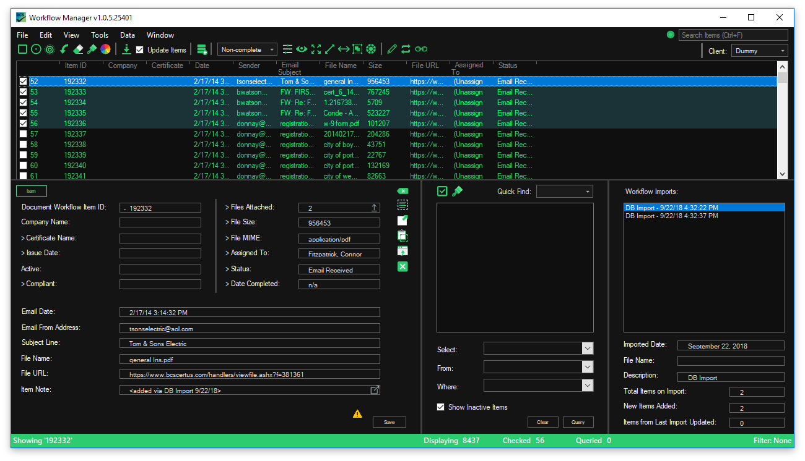
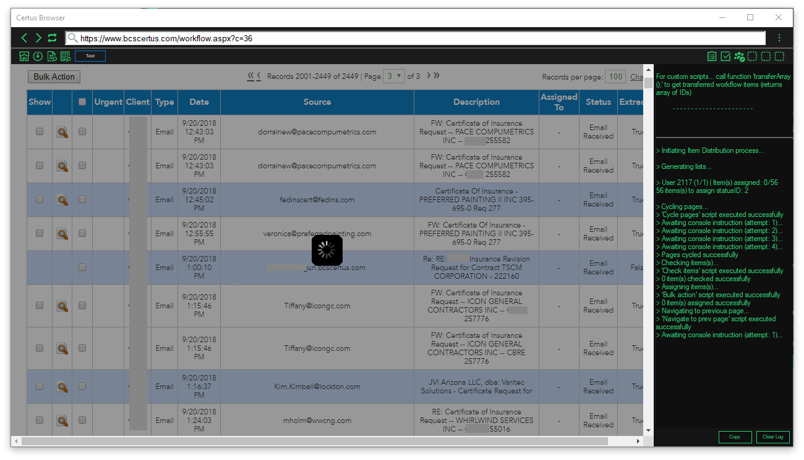

# Workflow Manager for BCS

## What is it?

Workflow Manager, or *Certus Companion*, is a Windows desktop application for viewing and manipulating BCS Workflow Data.

Integrated chrome web browser with embedded javascript functions for automatically applying changes to the database.

---
## Features
* Import realtime datasources directly from the SQL database 
* Find nonessential workflow items and mark as complete/trash automatically using the integrated browser
* Find missing data for workflow items and make changes automatically using the integrated browser
* Find analyst assignments for items and distribute automatically using the integrated browser
* Save and load changes to data in application data files (workspaces)
* Save and load browser configuration settings and import custom javascript functions

---
## Change Log
### v1.0.5
* Added an option to filter by analysts with/without markets
* Fixed a bug where save changes alert was appearing even after clicking save
* Changed analyst subsource to just include all company analysts everytime
### v1.0.4
* Laucher text changed from "Certus Companion" to "Workflow Manager"
* Setup project recreated
* Notification panel showing incorrectly when in full view - fixed
* Client not auto-populating in import from DB form - fixed
* Browser scripts will now be disabled if missing required data (ie analyst IDs)
### v1.0.3
* CSV import not completing older items - fixed
* Deselect all not deselecting all - fixed
* Removed notification button click event registrations (now just there to notify)
### v1.0.2
* 'Non-completed' View Choice is no longer selected if there are no noncompeted items available
* Client combo box text can no longer be manually edited 
* ';' char in Client combo box will not be accepted
* Workflow item .csv import can now accept the headers which would be copied from the List View
### v1.0.1
* Browser now uses properites settings data as opposed to reading .txt config file
* Dialog option buttons will highlight blue when they are entered
* Dialogs all should now open with the most commonly pressed button already entered
* Main form will remove all reference tabs on clear workspace
* Fixed a bug with clicking the > Certificate Name label
* Fixed a bug with the loading form on import from DB and removed the first 25% as it would just pause there while waiting for the query
* Removed close option for database connection loading forms (user can press F4 if they have to)
### v1.0.0
* Application release launch